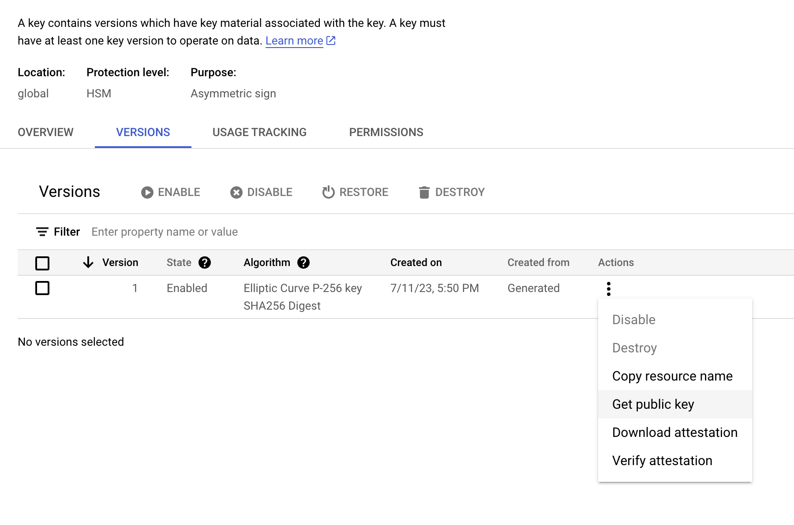
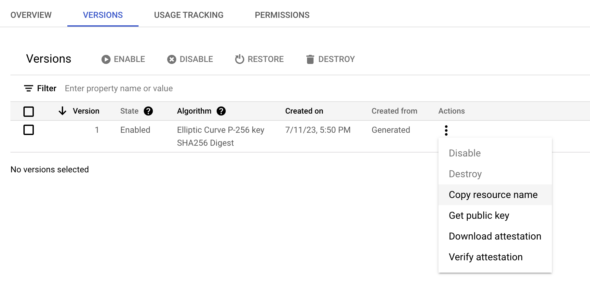

# Flow Google Cloud KMS Test

> This repo will help you test the addition and signing of KMS-managed key against a Flow account on your localnet

## Pre-requisites

- [Install Flow CLI](https://developers.flow.com/tools/flow-cli/install)
- [Have a configured assymetric signing key configured in Google Cloud's
  KMS](https://cloud.google.com/kms/docs/create-key#kms-create-symmetric-encrypt-decrypt-console)
- [Install gcloud CLI](https://cloud.google.com/sdk/docs/install)

### Optional setup

If you would like to enable more seamless KMS signing after configuring gcloud CLI, you can export Application Default
Credentials (ADC) as an environment variable to your machine.

Simply run:

```sh
gcloud auth application-default login
```

Your browser will likely open, asking you to login to your GCP account and allowing ADC (or similar) to your account.
After confirming, your terminal will output something along the lines of:

```sh
Credentials saved to file: [<HOME_DIR>/.config/gcloud/application_default_credentials.json]
```

Copy that path and export the following environment variable:

```sh
export GOOGLE_APPLICATION_CREDENTIALS=<YOUR_ADC_PATH>
```

Completing this setup will avoid the need to authorize KMS signing via Google OAuth in-browser, favoring instead your
local ADC.

## Overview

In this walkthrough, we're going to:

1. [Decode the public key](#decode-the-public-key)
1. [Create an account and add our KMS key to the new account](#create-an-account-with-the-kms-public-key)
1. [Add the account to our `flow.json`](#update-your-flowjson)
1. [Run a dry run transaction to validate the KMS configuration is correct](#dry-run)

### Decode the public key

From your key view in the GCP console, you'll have the option to view the public key.



Copy that to [`encoded_public_key.example.pem`](./encoded_public_key.example.pem) and rename to
`encoded_public_key.pem`.

To get the decoded public key string, we'll run the Flow CLI command:

```sh
flow keys decode pem --from-file encoded_public_key.pem
```

Which should output the public key like so:

```sh
Public Key              <YOUR_PUBLIC_KEY_STRING>
Signature Algorithm     ECDSA_P256
```

### Create an account with the KMS public key

Time to run our localnet:

```sh
flow emulator
```

Copy your decoded public key string, and run the following Flow CLI command:

```sh
flow accounts create \
    --key <YOUR_PUBLIC_KEY_STRING> \
    --hash-algo SHA2_256
```

You'll get an output denoting your account address and the info of the key that was just added.

### Update your [flow.json](./flow.json)

Next, we need to add the account we just created to our project config so we can submit a test transaction using Flow
CLI. For that, we'll need two things:

- The account address - the one we just created in emulator
- Your KMS key resource name - this is typically of the format
  `projects/<PROJECT_NAME>/locations/global/keyRings/<KEY_RING_NAME>/cryptoKeys/<KEY_NAME>/cryptoKeyVersions/<VERSION>`

You can find your key's resource name in the key view of your GCP console



The `accounts` field in [`flow.json`](./flow.json) should look like the following:

```json
"accounts": {
    "emulator-account": {
        "address": "f8d6e0586b0a20c7",
        "key": "8cd21494ff2917e50ac3f92c09f0728df5a78de977d1b6efaae3521ea9960022"
    },
    "kms-test-emulator": {
        "address": "<ACCOUNT_ADDRESS>",
        "key": {
            "hashAlgorithm": "SHA2_256",
            "resourceID": "projects/<PROJECT_NAME>/locations/global/keyRings/<KEY_RING_NAME>/cryptoKeys/<KEY_NAME>/cryptoKeyVersions/1",
            "type": "google-kms"
        }
    }
}
```

### Dry run

And finally, we can sign a dry run transaction. For the sake of testing, we'll use a simple log statement in
[`dry_run.cdc`](./transactions/dry_run.cdc) with the following command:

```sh
flow transactions send ./transactions/dry_run.cdc --signer kms-test-emulator
```

To acquire an authorizing signature, you'll be taken to a Google OAuth page where you can enter your GCP account
credentials and click 'Allow' to authorize the dry run transaction signature.

If you configured your key correctly, you should see the transaction executed successfully and a log statement in your
emulator terminal window.

## Resources

### Flow CLI

- [Example `flow.json` config for Google
  KMS](https://developers.flow.com/next/tools/flow-cli/flow.json/configuration#advanced-format-1)

### GCP

- [Creating a key](https://cloud.google.com/kms/docs/create-key)
- [Retrieving a public key](https://cloud.google.com/kms/docs/retrieve-public-key)
- [Getting a KMS resource ID](https://cloud.google.com/kms/docs/getting-resource-ids)
- [Configuring Application Default
  Credentials](https://cloud.google.com/docs/authentication/application-default-credentials)
